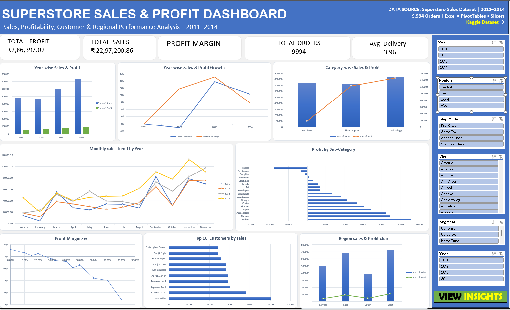
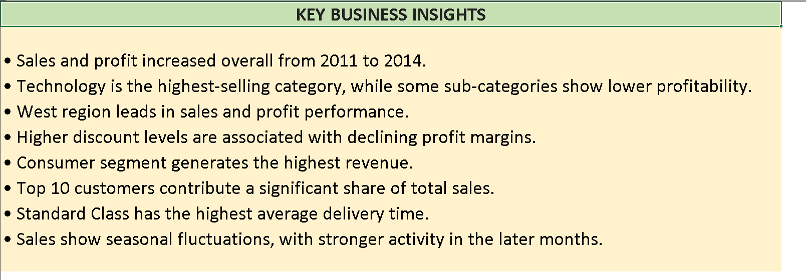
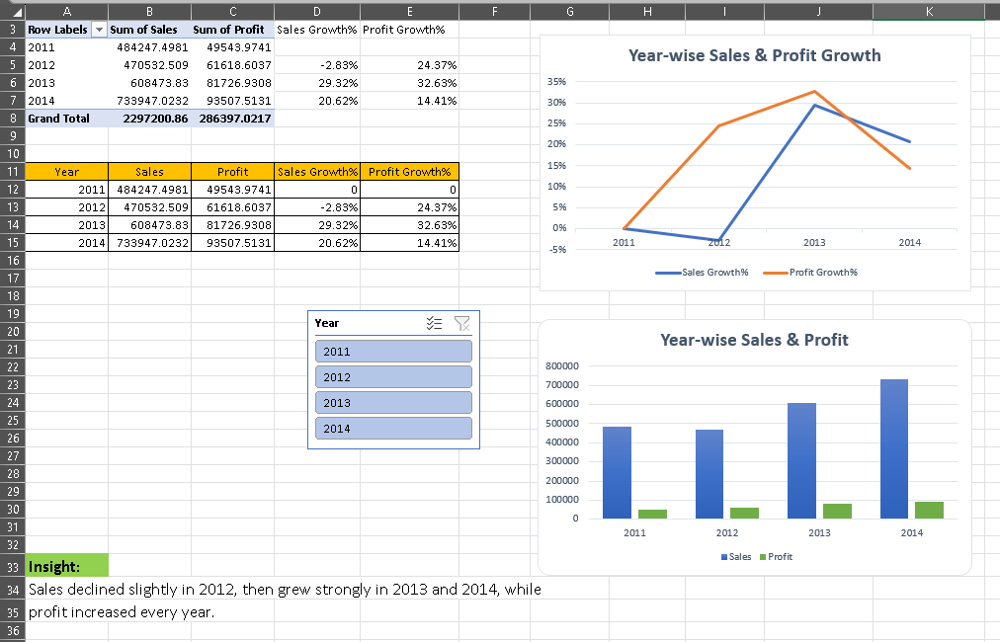

# Superstore Sales & Profit Analysis

## 📌 Project Overview
An interactive Excel dashboard analyzing sales, profitability, customer performance, regional performance, and delivery trends using the Superstore dataset.

## 🎯 Objective
To analyze sales and profit performance across different years, categories, regions, customers, and shipping modes, and identify key business trends and areas of concern.

## 💼 Business Problem
Retail businesses generate large amounts of sales data but need clear insights to understand revenue, profitability, customer contribution, regional performance, and delivery patterns. This project transforms raw sales data into an interactive dashboard for business analysis.

## 📂 Data Source
**Dataset:** Superstore Sales Dataset  
**Records:** 9,994 rows  
**Columns:** 21  
**Period:** 2011–2014  

The original dataset was obtained from Kaggle and contains order, customer, product, sales, profit, discount, region, shipping, and date information.

**Project Excel File:** [Superstore Dashboard](./Superstore_Dashboard.xlsx)

## 🔄 Data Preparation
The raw Superstore dataset (9,994 rows, 21 columns) was profiled and cleaned in Excel Power Query without editing the source file.

Key preparation steps:
- Fixed data types
- Trimmed extra spaces in text fields
- Added Delivery Days
- Added Year, Quarter, Month, and Month Name from existing date columns

## 🛠️ Tools & Techniques
- Microsoft Excel
- Power Query – Data cleaning and transformation
- PivotTables – Data analysis
- PivotCharts – Data visualization
- Slicers – Interactive filtering
- Excel formulas – KPI calculations

## 📊 Dashboard Analysis
- Year-wise Sales & Profit
- Sales & Profit Growth
- Category-wise Sales & Profit
- Monthly Sales Trends
- Profit by Sub-Category
- Top 10 Customers by Sales
- Regional Sales & Profit
- Profit Margin
- Average Delivery Days

## 📈 Key KPIs
- Total Sales
- Total Profit
- Profit Margin
- Total Orders
- Average Delivery Days

## 📷 Dashboard Preview

### Interactive Dashboard

### Key Business Insights

### Analysis & Pivot Table

## 💡 Key Business Insights
- Sales and profit increased overall from 2011 to 2014.
- Technology is the highest-selling category.
- West region leads in sales and profit performance.
- Higher discount levels are associated with declining profit margins.
- Consumer segment generates the highest revenue.
- Top 10 customers contribute a significant share of total sales.
- Standard Class has the highest average delivery time.
- Sales show seasonal fluctuations, with stronger activity in later months.

## 📁 Project Files
- [Excel Dashboard](./Superstore_Dashboard.xlsx)
- Dashboard Screenshot
- Key Business Insights Screenshot
- Analysis & Pivot Table Screenshot
